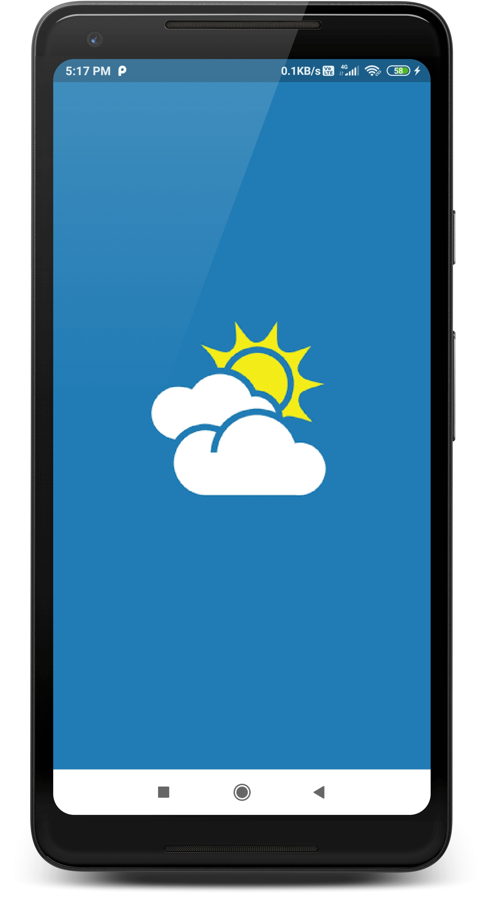
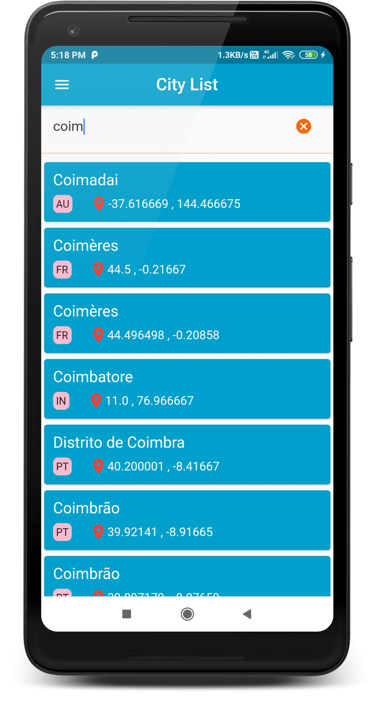

# World Weather (Flutter)

- User can able to view cities and their weather details. 
- User can able to view current location weather details.
- User can able to view weather details of near by location in map view.
- User can move the pointer in the map view to get the weather details of near by places of the pointer (around 50 places weather).

Used openweathermap weather APIs  
https://openweathermap.org/ 

# How to Run the app

# Update openweathermap API token  
Follow the steps given in the below site to get API token 
https://openweathermap.org/appid

lib\app_data\globals.dart file 

```sh
String apiToken = 'YourOpenWeatherMapAPIToken';
```

# Update your google map API token 

# Android 
In AndroidManifest.xml file 
Follow the steps given in the below site to get API token 
https://developers.google.com/maps/documentation/android-sdk/get-api-key

```sh
  <meta-data android:name="com.google.android.geo.API_KEY"
  android:value="YourGoogleMapAPI_TOKEN"/>
```
# iOS
In AppDelegate.swift file

```sh
GMSServices.provideAPIKey("YourGoogleMapAPI_TOKEN")
```  


# ScreenShots

       


 
  
